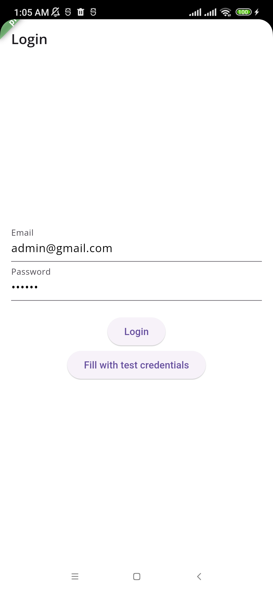
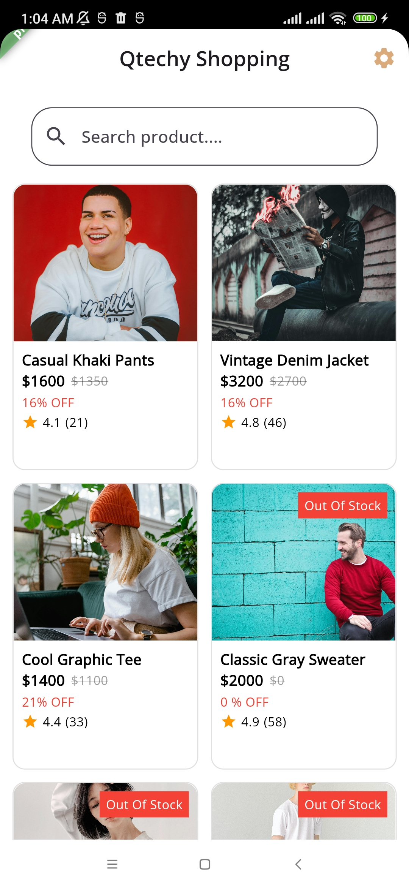
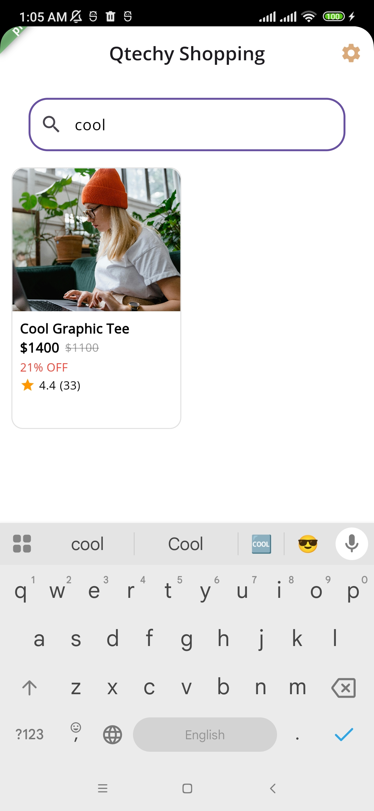
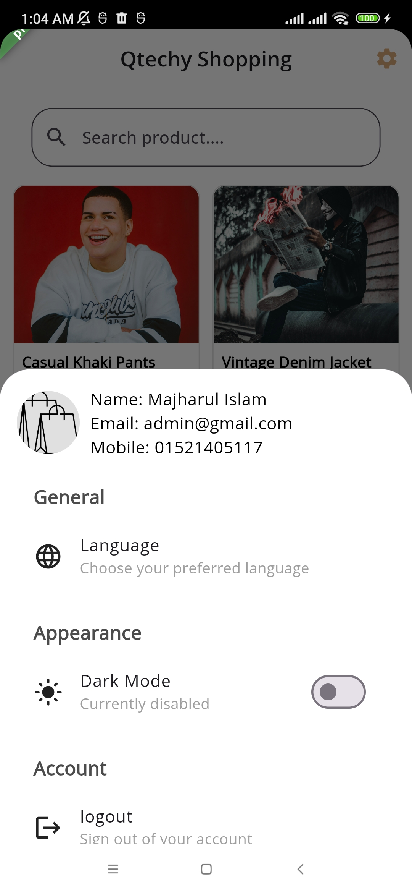
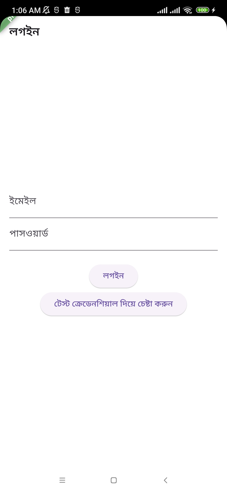
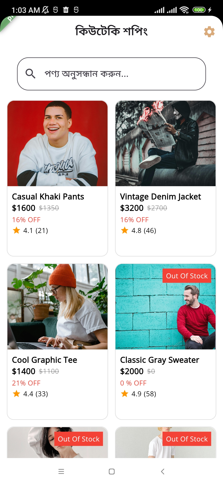
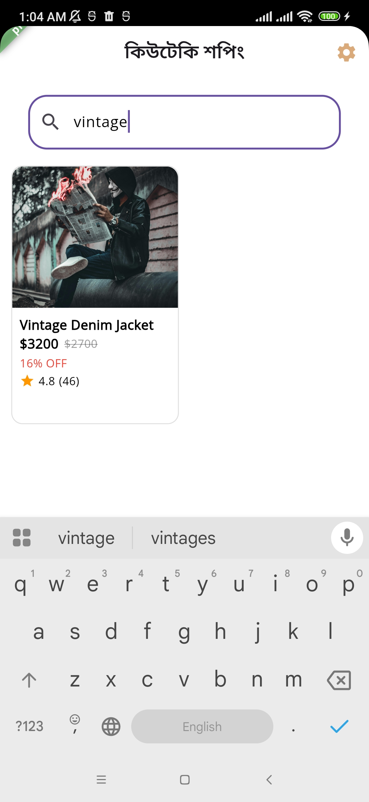
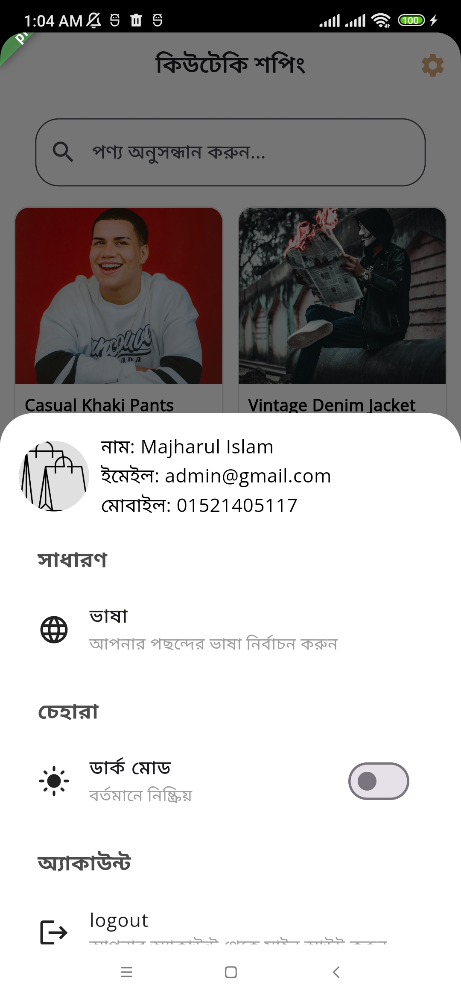
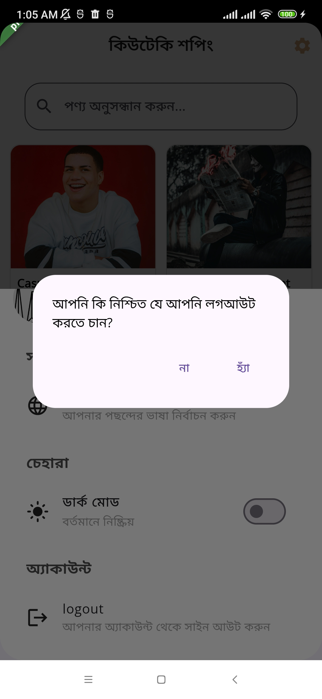
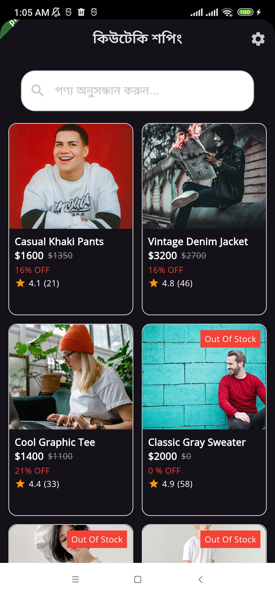

# Qtechy

## Table of Contents

1. [Project Overview](#project-overview)
2. [Resources](#resources)
3. [Features](#features)
4. [App Screenshots](#app-screenshots)
5. [Technical Specifications](#technical-specifications)
   - [Architecture](#architecture)
   - [State Management](#state-management)
   - [Networking](#networking)
   - [Authentication & Secure APIs](#authentication--secure-apis)
   - [Routing](#routing)
   - [Localization](#localization)
   - [Dependency Injection](#dependency-injection)
   - [Handling Data and Internet Connectivity](#handling-data-and-internet-connectivity)
6. [Installation](#installation)
7. [Running the App](#running-the-app)
8. [Testing](#testing)

---

## Project Overview

**Qtechy Shopping** is a Flutter-based mobile application that allows users to browse, filter products from a variety of products. It integrates with a backend API for user authentication, product showcase, providing a seamless e-commerce experience.

## Resources

- **API Base URL**: `https://qtechy-backend.onrender.com/api/`
- **Backend Repository**: [Qtechy Backend GitHub](https://github.com/majharul-islam181/QTechy-Backend)
- **Auth API**: Used for login and logout (`auth/login`, `auth/logout`)
- **Product API**: Retrieves product listings with all details (`/products/getProduts`)
- **Dio**: Handles API requests with error handling
- **Shared Preferences**: Stores authentication tokens securely for user sessions

---

## Features

### 1️⃣ **Authentication**

- **User Login**: Users can log in with their credentials.
- **Token Management**: The app securely stores the authentication token after a successful login.
- **Logout Functionality**: The app provides a logout feature that clears stored user data and tokens.

### 2️⃣ **Product Listing**

- **Retrieve Products**: The app fetches products and their stock details.
- **Search Functionality**: Users can search for products by name.
- **Stock & Pricing Details**: The product list includes name, stock quantity, price, and master pack details.
- **Quantity Selection**: Users can increase/decrease the quantity of selected products.

### 3️⃣ **Checkout & Order Management**

- **Review Selected Products**: The checkout page displays the selected products, their quantities, and total prices.
- **Stock Validation**: The app ensures that selected products are available before proceeding to checkout.
- **Remove & Modify Products**: Users can modify product quantities or remove items from the checkout list.
- **Submit Order**: A placeholder function simulates order placement.

---

## App Screenshots

<p float="left">
<!-- english -->
  

  
     
  
  <!-- bangla -->
    

  
     
  
  <!-- dark mode -->
      

  
</p>

---

## Technical Specifications

### 📌 **Architecture**

- **Clean Architecture**: The app follows a layered structure:
  - **Data Layer**: Manages API calls and data sources.
  - **Domain Layer**: Contains business logic and use cases.
  - **Presentation Layer**: Manages UI and user interactions.

### 📌 **State Management**

- **BLoC (Business Logic Component)**: Used for managing authentication, product listing, and checkout state.

### 📌 **Networking**

- **Dio**: Used for handling API requests and error handling.
- **Pretty Dio Logger**: Provides API request/response logging in debug mode.

### 📌 **Authentication & Secure APIs**

- **Bearer Token Authentication**: The app securely stores and passes the authentication token in API requests.
- **Shared Preferences**: Stores the token persistently for maintaining user sessions.

### 📌 **Routing**

- **GoRouter**: Manages screen transitions efficiently.

### 📌 **Localization**

- **Easy Localization**: Supports multi-language UI, allowing users to switch languages.
- **Language Support**: Currently supports English and Bengali.

### 📌 **Dependency Injection**

- **GetIt**: Manages service dependencies, ensuring modular and scalable code.

### 📌 **Handling Data and Internet Connectivity**

- **Connectivity Package**: Checks internet connectivity before making API requests.
- **Error Handling**: Provides clear error messages for API failures and network issues.

## Running the App

### With Android Studio

- Open the project in **Android Studio**, where launch configurations for different flavors (**development** and **production**) are saved.
- Select the appropriate configuration and **run the app**.
- Also, select **Run All Tests** to execute all unit and widget tests.

### From Command Line

#### 🚀 **Run the App**

- **For Development Flavor:**
  ```sh
  flutter run --flavor development -t lib/app/env/main_development.dart
  ```
- **For Production Flavor:**
  ```sh
  flutter run --flavor production -t lib/app/env/main_production.dart
  ```

#### 🧪 **Run Tests**

- Execute all tests:
  ```sh
  flutter test
  ```

#### 📦 **Build APK**

- **For Development Build:**

  ```sh
  flutter build apk --flavor development -t lib/app/env/main_development.dart
  ```

- **For Production Build:**
  ```sh
  flutter build apk --flavor production -t lib/app/env/main_production.dart
  ```

#### 📦 **Build App Bundle (AAB)**

- **For Play Store Upload:**
  ```sh
  flutter build appbundle --flavor production -t lib/app/env/main_production.dart

  ```
- **For Production Build:**
  ```sh
  flutter build apk --flavor production -t lib/app/env/main_production.dart
  ```

---

## Installation

### 1️⃣ Clone the repository:

```sh
git clone https://github.com/majharul-islam181/QTecy
```

## Installation

### 1️⃣ Download Qtchey-Shopping App:

```sh
https://drive.google.com/drive/folders/1y72MyLMh9ZrnqsXlbMSY9n3bmZ5kIVhQ?usp=sharing
```
